# Aerostack2 아키텍처 다이어그램

> 이 문서는 Aerostack2 코드베이스의 구조, 메시지 흐름, 모듈 연계를 다이어그램으로 시각화합니다.
> Mermaid 렌더링을 지원하는 뷰어(GitHub, VS Code + Mermaid 플러그인, Obsidian 등)에서 보세요.

---

## 1. 전체 시스템 계층 아키텍처

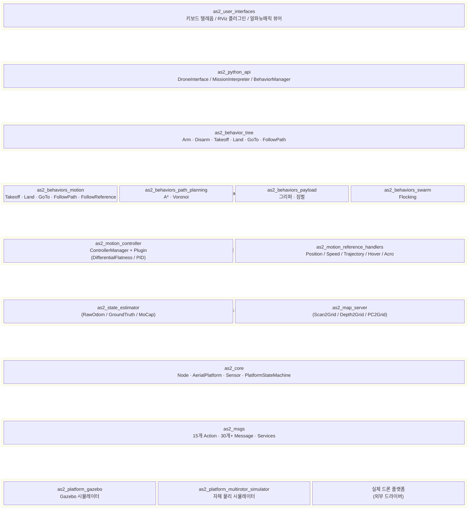

---

## 2. 핵심 모듈 블록도 & 연계 구조

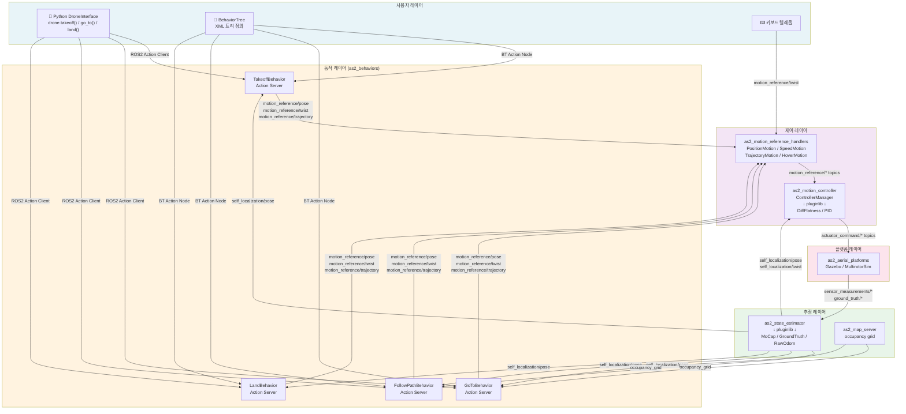

---

## 3. 메시지(토픽) 흐름 상세도

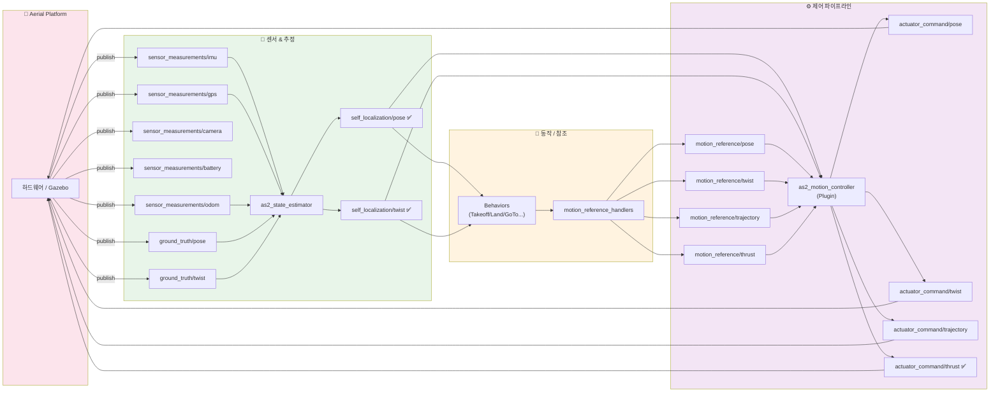

---

## 4. 플랫폼 상태 머신 (PlatformStateMachine)

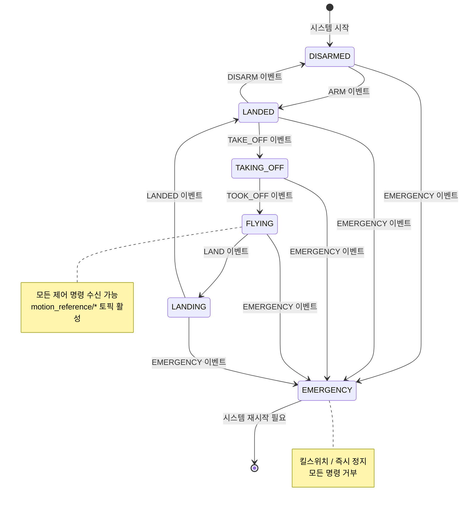

---

## 5. 제어 모드 인코딩 & 파이프라인

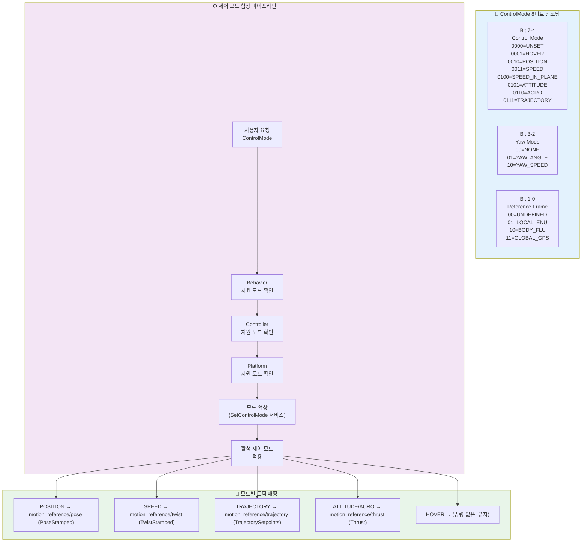

---

## 6. 동작(Behavior) 실행 흐름 — 시퀀스 다이어그램

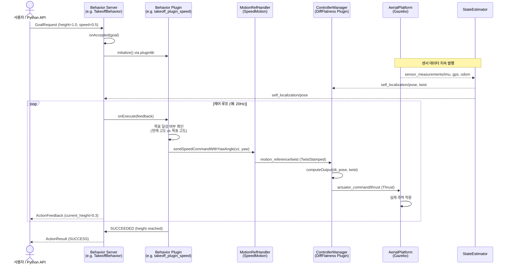

---

## 7. 플러그인 아키텍처 구조도

```mermaid
graph TB
    subgraph BEHAVIORS["🎯 Behavior Plugins (pluginlib)"]
        direction TB
        BS["BehaviorServer\n(as2_behaviors_motion)"]
        TP1["takeoff_plugin_speed"]
        TP2["takeoff_plugin_position"]
        TP3["takeoff_plugin_platform"]
        TP4["takeoff_plugin_trajectory"]
        GP1["go_to_plugin_position"]
        GP2["go_to_plugin_trajectory"]
        FP1["follow_path_plugin_position"]
        FP2["follow_path_plugin_trajectory"]
        LP1["land_plugin_speed"]
        LP2["land_plugin_platform"]
        LP3["land_plugin_trajectory"]
        BS -- "ClassLoader\n(plugin_name param)" --> TP1 & TP2 & TP3 & TP4
        BS -- "ClassLoader" --> GP1 & GP2
        BS -- "ClassLoader" --> FP1 & FP2
        BS -- "ClassLoader" --> LP1 & LP2 & LP3
    end

    subgraph CONTROLLERS["⚙️ Controller Plugins (pluginlib)"]
        direction TB
        CM["ControllerManager"]
        CP1["differential_flatness_controller::Plugin\n(비선형 제어)"]
        CP2["pid_speed_controller::Plugin\n(PID 제어)"]
        CM -- "ClassLoader\n(controller_plugin param)" --> CP1 & CP2
    end

    subgraph ESTIMATORS["📡 State Estimator Plugins (pluginlib)"]
        direction TB
        SE["StateEstimator"]
        SEP1["raw_odometry::Plugin"]
        SEP2["ground_truth::Plugin"]
        SEP3["mocap_pose::Plugin\n(OptiTrack)"]
        SEP4["ground_truth_odometry_fuse::Plugin"]
        SE -- "ClassLoader" --> SEP1 & SEP2 & SEP3 & SEP4
    end

    subgraph PLANNERS["🗺️ Path Planning Plugins (pluginlib)"]
        direction TB
        PP["PathPlannerBehavior"]
        PP1["a_star::Plugin"]
        PP2["voronoi::Plugin"]
        PP -- "ClassLoader" --> PP1 & PP2
    end

    subgraph MAPPERS["🗺️ Map Server Plugins (pluginlib)"]
        direction TB
        MP["MapServer"]
        MP1["scan2occ_grid::Plugin"]
        MP2["depth2occ_grid::Plugin"]
        MP3["point_cloud2occ_grid::Plugin"]
        MP -- "ClassLoader" --> MP1 & MP2 & MP3
    end

    style BEHAVIORS fill:#fff3e0
    style CONTROLLERS fill:#f3e5f5
    style ESTIMATORS fill:#e8f5e9
    style PLANNERS fill:#e3f2fd
    style MAPPERS fill:#fce4ec
```

---

## 8. Python API 모듈 구조

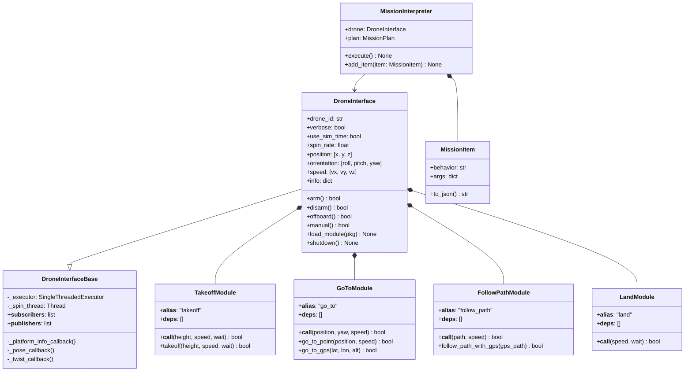

---

## 9. ROS 2 서비스 & 액션 인터페이스 맵

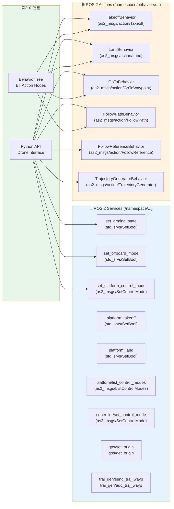

---

## 10. 다중 드론(Multi-Robot) 네임스페이스 구조

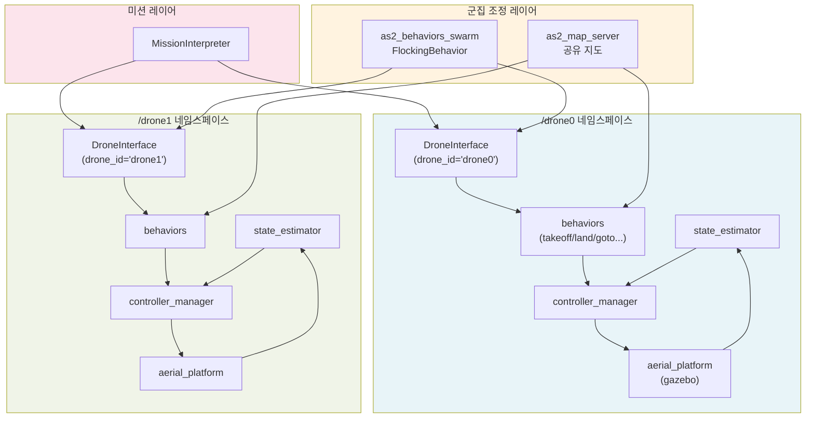

---

## 11. as2_core 핵심 클래스 다이어그램

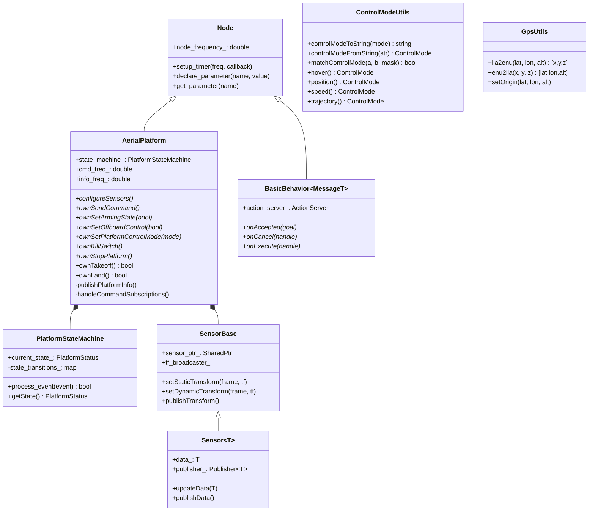

---

## 12. 빌드 의존성 그래프

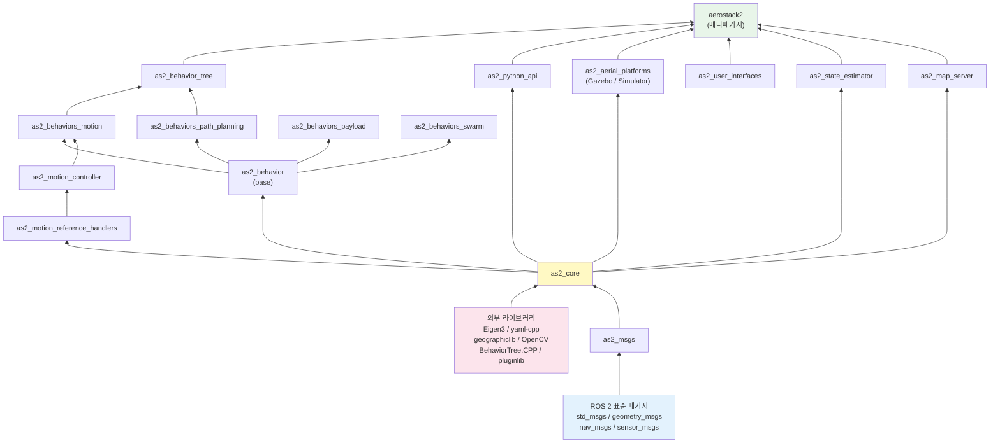

---

*Generated from Aerostack2 v1.1.3 source analysis — 2026-03-25*
