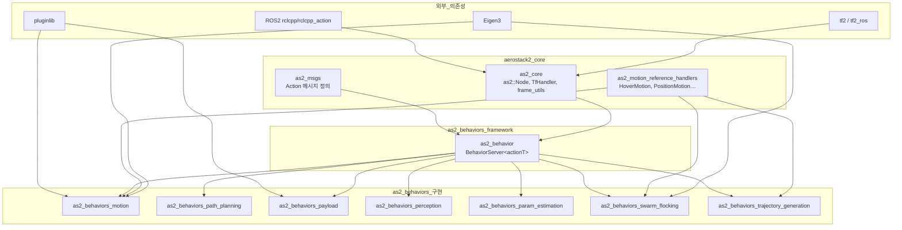
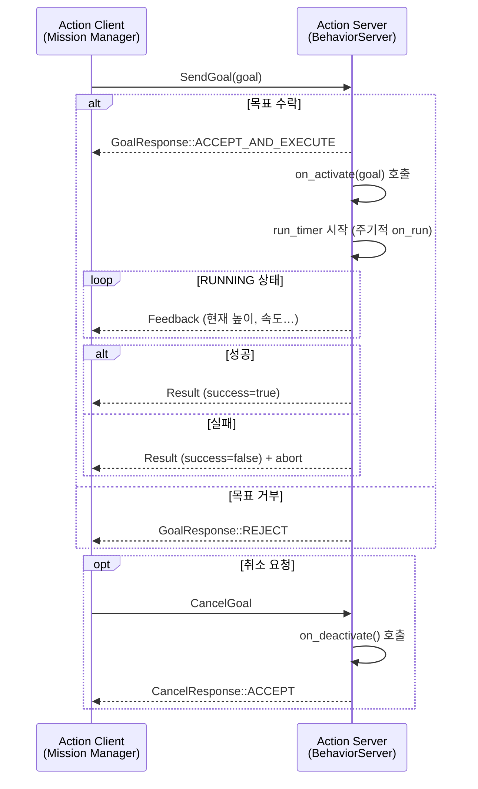
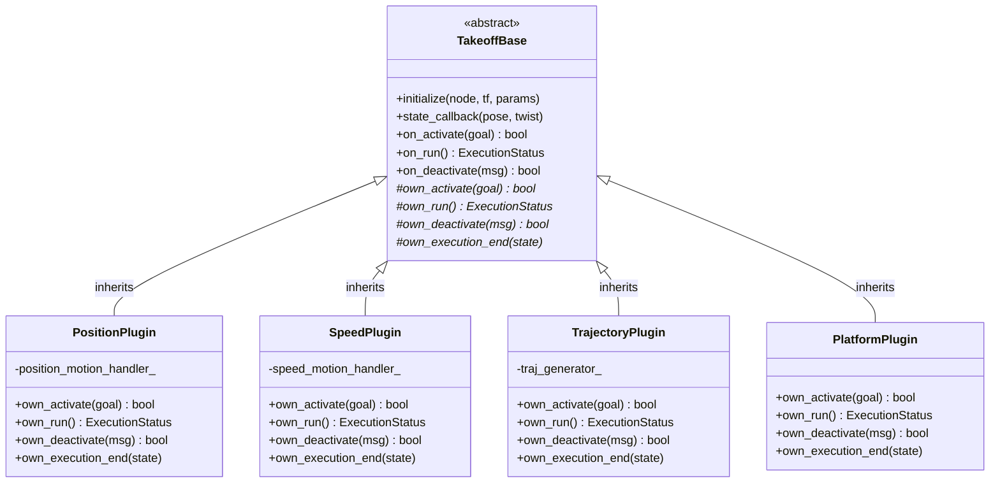
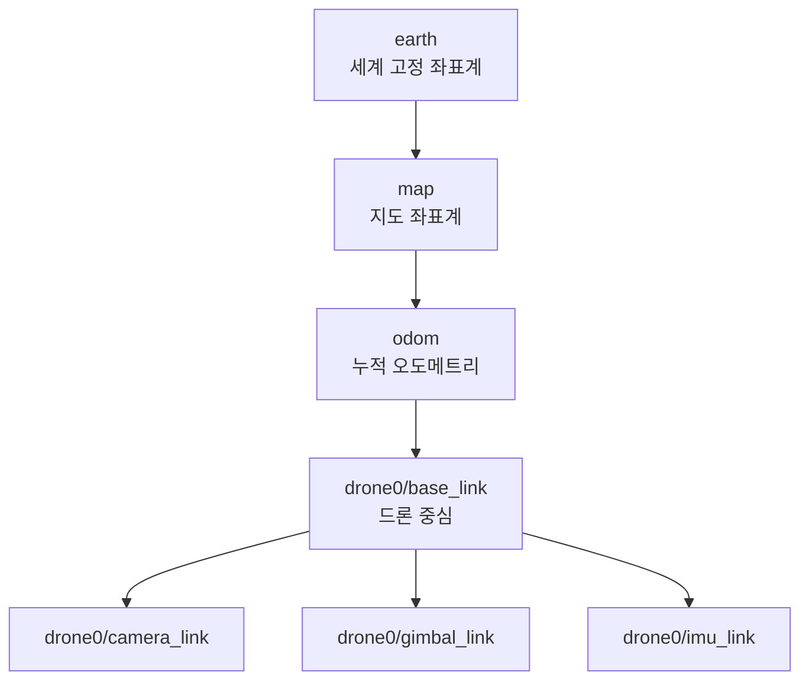
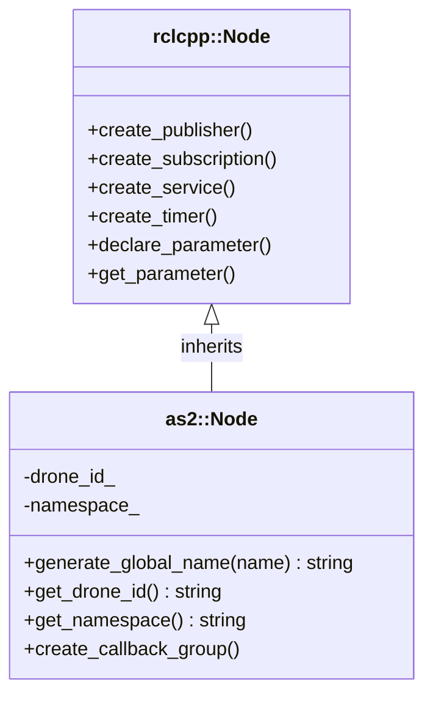
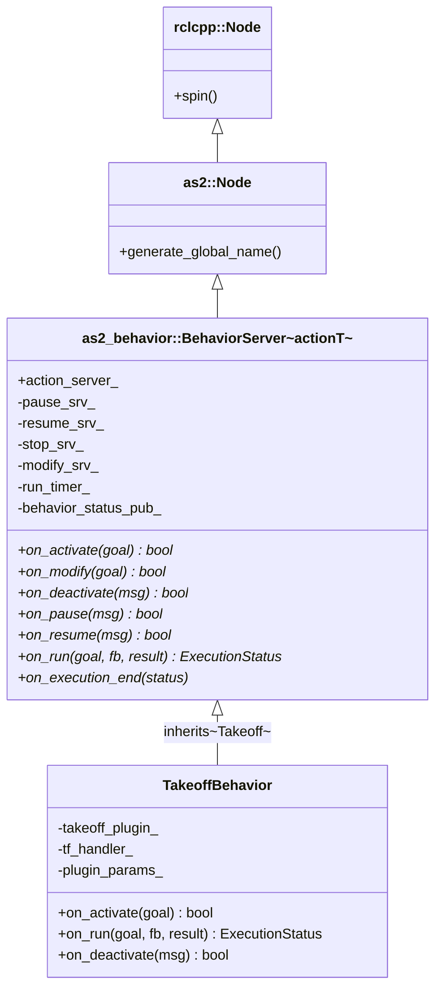
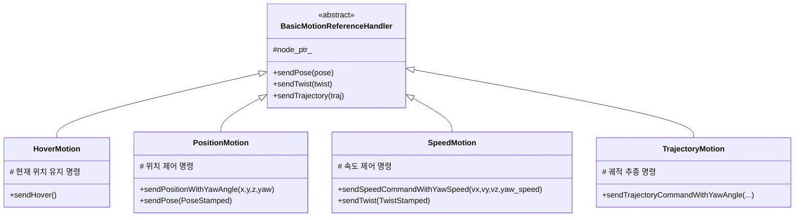
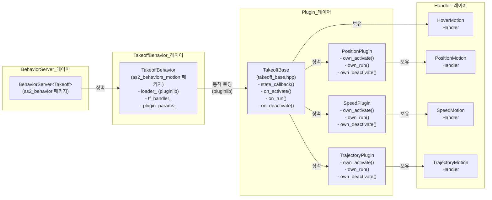
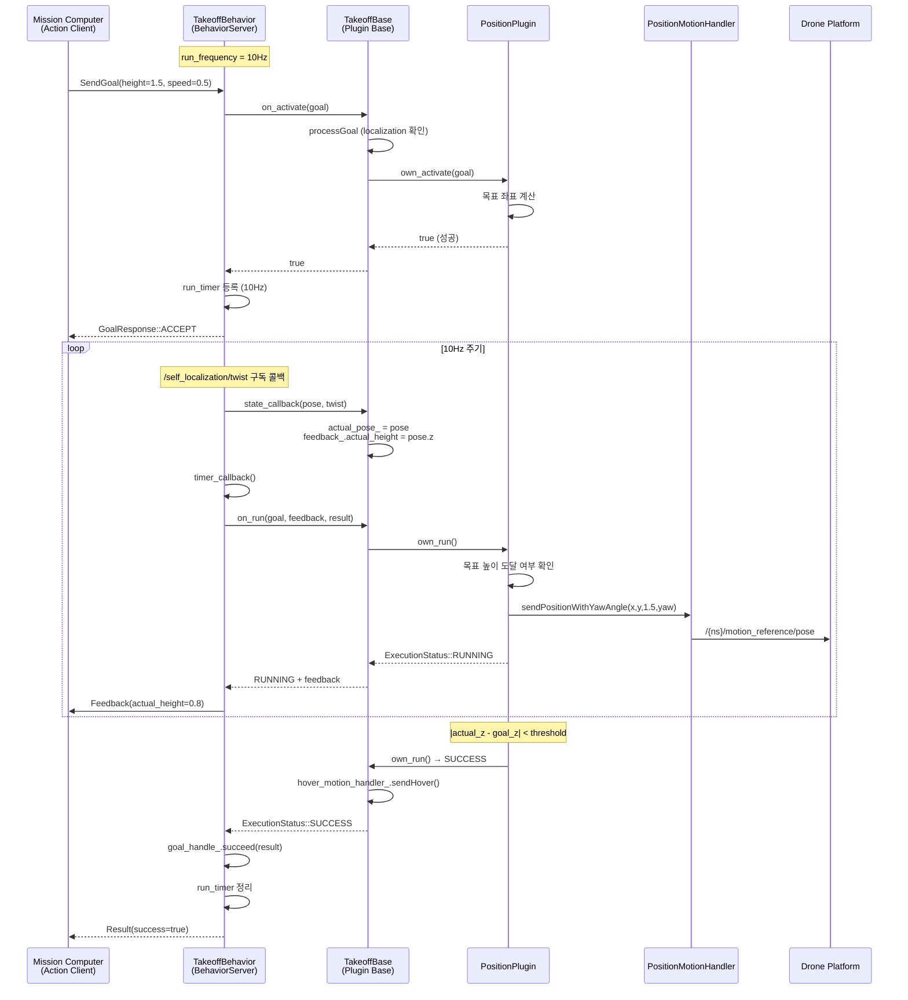
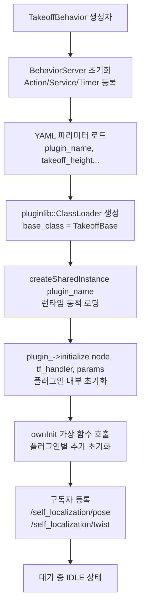

# as2_behaviors 패키지 분석을 위한 사전지식

> aerostack2의 `as2_behaviors` 패키지를 이해하기 위해 필요한 ROS2 및 aerostack2 개념들을 정리한 문서입니다.

---

## 목차

1. [패키지 전체 구조](#1-패키지-전체-구조)
2. [ROS2 Action Server/Client](#2-ros2-action-serverclient)
3. [pluginlib 플러그인 시스템](#3-pluginlib-플러그인-시스템)
4. [rclcpp_components (컴포넌트 노드)](#4-rclcpp_components-컴포넌트-노드)
5. [TF2 좌표계 변환](#5-tf2-좌표계-변환)
6. [as2::Node (aerostack2 기본 노드)](#6-as2node-aerostack2-기본-노드)
7. [BehaviorServer 템플릿 패턴](#7-behaviorserver-템플릿-패턴)
8. [as2_motion_reference_handlers](#8-as2_motion_reference_handlers)
9. [ExecutionStatus 상태 머신](#9-executionstatus-상태-머신)
10. [Motion Behavior + Plugin 통합 구조](#10-motion-behavior--plugin-통합-구조)

---

## 1. 패키지 전체 구조

`as2_behaviors`는 여러 서브 패키지로 구성된 모노레포 구조입니다.

```
as2_behaviors/
├── as2_behavior/                         ← 핵심 프레임워크 (BehaviorServer)
├── as2_behaviors_motion/                 ← 이동 행동 (Takeoff, Land, GoTo, FollowPath …)
├── as2_behaviors_path_planning/          ← 경로 계획 (A*, Voronoi)
├── as2_behaviors_payload/                ← 페이로드 (Gripper, Gimbal)
├── as2_behaviors_perception/             ← 인식 (ArUco 마커 검출)
├── as2_behaviors_param_estimation/       ← 파라미터 추정 (질량, 힘)
├── as2_behaviors_swarm_flocking/         ← 군집 비행
├── as2_behaviors_trajectory_generation/  ← 다항식 궤적 생성
└── as2_behaviors_platform/               ← 플랫폼 기본 설정 런처
```

### 패키지 의존성 다이어그램



---

## 2. ROS2 Action Server/Client

**Action**은 ROS2에서 장시간 실행되는 비동기 작업을 처리하기 위한 통신 패턴입니다.  
서비스(Service)와 달리 실행 중 **피드백(Feedback)** 을 받을 수 있고, 도중에 **취소(Cancel)** 도 가능합니다.

### 2.1 Action 메시지 구조

```
MyAction.action
──────────────────
# Goal (요청)
float64 target_height
float64 speed
---
# Result (최종 결과)
bool success
string info
---
# Feedback (중간 상태)
float64 current_height
float64 current_speed
```

ROS2는 이 `.action` 파일로부터 자동으로 다음 서비스/토픽을 생성합니다:

| 자동 생성 인터페이스 | 타입 | 설명 |
|---|---|---|
| `/action_name` | action server | 목표 전송·취소·결과 수신 |
| `/_action/feedback` | topic | 피드백 스트림 |
| `/_action/status` | topic | 목표 상태 목록 |
| `/_action/get_result` | service | 결과 조회 |
| `/_action/cancel_goal` | service | 취소 요청 |

### 2.2 Action 통신 흐름



### 2.3 rclcpp_action::Server 콜백 3종

```cpp
// BehaviorServer 내부에서 등록하는 3가지 핸들러
rclcpp_action::create_server<actionT>(
    this, action_name,
    // 1) 목표 수락/거부 결정
    [](uuid, goal) -> GoalResponse { ... },
    // 2) 취소 수락/거부 결정
    [](goal_handle) -> CancelResponse { ... },
    // 3) 수락된 목표 처리 시작
    [](goal_handle) { ... }
);
```

---

## 3. pluginlib 플러그인 시스템

`pluginlib`은 런타임에 공유 라이브러리를 동적으로 로드해 특정 인터페이스(Base Class)의 구현체를 교체할 수 있게 해주는 ROS2 라이브러리입니다.

### 3.1 플러그인 구조



### 3.2 플러그인 등록 (plugins.xml)

```xml
<library path="takeoff_plugin_position">
  <class name="takeoff_plugin_position::Plugin"
         type="takeoff_plugin_position::Plugin"
         base_class_type="takeoff_base::TakeoffBase">
    <description>Position-based takeoff plugin</description>
  </class>
</library>
```

### 3.3 플러그인 동적 로딩 코드 패턴

```cpp
// TakeoffBehavior 내부
#include <pluginlib/class_loader.hpp>

// 1) ClassLoader 생성 (base class 타입으로)
std::shared_ptr<pluginlib::ClassLoader<takeoff_base::TakeoffBase>> loader_;
loader_ = std::make_shared<pluginlib::ClassLoader<takeoff_base::TakeoffBase>>(
    "takeoff_behavior",          // 패키지 이름
    "takeoff_base::TakeoffBase"  // base class 전체 이름
);

// 2) YAML 파라미터에서 플러그인 이름 읽기
std::string plugin_name;
this->get_parameter("plugin_name", plugin_name);
// plugin_name = "takeoff_plugin_position::Plugin"

// 3) 런타임에 인스턴스 생성
takeoff_plugin_ = loader_->createSharedInstance(plugin_name);

// 4) 초기화 후 사용
takeoff_plugin_->initialize(this, tf_handler_, plugin_params_);
```

### 3.4 플러그인 선택 (YAML 설정)

```yaml
# config/config_default.yaml
takeoff_behavior:
  ros__parameters:
    plugin_name: "takeoff_plugin_position::Plugin"
    # 또는: "takeoff_plugin_speed::Plugin"
    # 또는: "takeoff_plugin_trajectory::Plugin"
    # 또는: "takeoff_plugin_platform::Plugin"
    takeoff_height: 1.0
    takeoff_speed: 0.5
    takeoff_threshold: 0.1
```

---

## 4. rclcpp_components (컴포넌트 노드)

`rclcpp_components`는 노드를 별도의 실행 파일 없이 공유 라이브러리 형태로 빌드하고, 런타임에 **하나의 프로세스에 여러 노드를 조합**할 수 있게 해주는 ROS2 기능입니다.

### 4.1 일반 노드 vs 컴포넌트 노드

```
일반 노드 (executable)          컴포넌트 노드 (shared library)
┌────────────────────┐          ┌────────────────────────────┐
│ main()             │          │ .so (공유 라이브러리)        │
│   spin(node)       │          │   class TakeoffBehavior    │
│                    │          │     : public rclcpp::Node  │
└────────────────────┘          └────────────────────────────┘
        ↓                                    ↓
  단독 프로세스 실행             component_container에 동적 로딩
                                (여러 노드를 한 프로세스에서 실행)
```

### 4.2 컴포넌트 등록 코드

```cpp
// CPP 파일 끝에 매크로로 등록
#include <rclcpp_components/register_node_macro.hpp>
RCLCPP_COMPONENTS_REGISTER_NODE(takeoff_behavior::TakeoffBehavior)
```

### 4.3 CMakeLists.txt에서의 빌드 설정

```cmake
# 컴포넌트로 빌드 (공유 라이브러리)
add_library(takeoff_behavior SHARED src/takeoff_behavior.cpp)
rclcpp_components_register_nodes(takeoff_behavior
    "takeoff_behavior::TakeoffBehavior")

# 단독 실행 파일도 제공 (선택적)
add_executable(takeoff_behavior_node src/takeoff_behavior_node.cpp)
target_link_libraries(takeoff_behavior_node takeoff_behavior)
```

### 4.4 런치 파일에서의 사용

```python
# launch 파일에서 컴포넌트 컨테이너에 노드 로딩
from launch_ros.actions import ComposableNodeContainer, ComposableNode

container = ComposableNodeContainer(
    name='behavior_container',
    namespace='drone0',
    package='rclcpp_components',
    executable='component_container',
    composable_node_descriptions=[
        ComposableNode(
            package='takeoff_behavior',
            plugin='takeoff_behavior::TakeoffBehavior',
            name='TakeoffBehavior',
        ),
    ],
)
```

---

## 5. TF2 좌표계 변환

드론은 여러 **좌표계(frame)**를 사용합니다. TF2는 이 좌표계 간 변환 정보를 트리 구조로 관리합니다.

### 5.1 aerostack2의 주요 좌표계

```
earth (고정 좌표계, NED/ENU)
  └── map (지도 좌표계)
        └── odom (오도메트리)
              └── drone0/base_link (드론 본체)
                    ├── drone0/camera_link
                    └── drone0/gimbal_link
```

### 5.2 TF 트리 구조



### 5.3 as2::tf::TfHandler 사용법

```cpp
#include "as2_core/utils/tf_utils.hpp"

// 1) TfHandler 생성
auto tf_handler = std::make_shared<as2::tf::TfHandler>(node_ptr);

// 2) 특정 프레임에서의 포즈 조회
geometry_msgs::msg::PoseStamped pose_in_map;
tf_handler->tryConvert(pose_in_base_link, "map", pose_in_map);

// 3) 좌표계 변환
geometry_msgs::msg::PointStamped point_in_earth;
tf_handler->tryConvert(point_in_drone_frame, "earth", point_in_earth);
```

### 5.4 Behavior에서의 TF 활용 예시 (GoTo Behavior)

```
Action Goal: "x=5, y=3, z=2 (map 프레임에서)"
        ↓
TfHandler: map → drone0/base_link 변환
        ↓
MotionReferenceHandler: 드론 프레임 기준 이동 명령 전송
        ↓
드론: base_link 기준으로 제어 명령 실행
```

---

## 6. as2::Node (aerostack2 기본 노드)

`as2::Node`는 `rclcpp::Node`를 상속하여 aerostack2에 특화된 기능을 추가한 기본 노드 클래스입니다.

### 6.1 as2::Node의 주요 추가 기능



### 6.2 네임스페이스 기반 토픽 이름 생성

aerostack2는 드론 ID를 네임스페이스로 사용합니다.  
`as2::Node::generate_global_name()`을 통해 일관된 토픽 이름을 생성합니다.

```cpp
// drone ID = "drone0"일 때
node->generate_global_name("TakeoffBehavior")
// 결과: "/drone0/TakeoffBehavior"

node->generate_global_name("self_localization/pose")
// 결과: "/drone0/self_localization/pose"
```

### 6.3 as2 표준 토픽 이름

| 토픽 | 메시지 타입 | 설명 |
|---|---|---|
| `/{ns}/self_localization/pose` | `PoseStamped` | 드론 위치/자세 |
| `/{ns}/self_localization/twist` | `TwistStamped` | 선속도/각속도 |
| `/{ns}/platform/info` | `PlatformInfo` | 플랫폼 상태 |
| `/{ns}/motion_reference/pose` | `PoseStamped` | 위치 제어 명령 |
| `/{ns}/motion_reference/twist` | `TwistStamped` | 속도 제어 명령 |
| `/{ns}/motion_reference/trajectory` | `TrajectoryPoint` | 궤적 제어 명령 |

---

## 7. BehaviorServer 템플릿 패턴

`BehaviorServer<actionT>`는 `as2_behavior` 패키지의 핵심 클래스로, Action Server를 기반으로 Behavior의 생명주기를 관리합니다.

### 7.1 클래스 계층 구조



### 7.2 BehaviorServer 내부 구조

```
BehaviorServer<actionT>
├── Action Server (rclcpp_action::Server<actionT>)
│     ├── handleGoal()    → on_activate() 호출 → run_timer 시작
│     ├── handleCancel()  → on_deactivate() 호출
│     └── handleAccepted()→ goal_handle_ 저장
│
├── Service Servers
│     ├── /_behavior/pause   → on_pause()
│     ├── /_behavior/resume  → on_resume()
│     ├── /_behavior/stop    → on_deactivate()
│     └── /_behavior/modify  → on_modify()
│
├── Publishers
│     └── /_behavior/behavior_status → BehaviorStatus 주기 발행
│
└── Timers
      ├── behavior_status_timer (100ms)  → publish_behavior_status()
      └── run_timer (1/run_frequency)    → timer_callback() → on_run()
```

### 7.3 BehaviorServer 생성 시 등록 순서

```cpp
BehaviorServer(name, options)
  : as2::Node(name, options)        // 1. as2::Node 초기화
{
    declare_parameter("run_frequency", 10.0);  // 기본 10Hz
    register_action();              // 2. Action Server 등록
    register_service_servers();     // 3. pause/resume/stop/modify 서비스 등록
    register_publishers();          // 4. behavior_status 퍼블리셔 등록
    register_timers();              // 5. behavior_status 타이머 등록 (100ms)
    // ※ run_timer는 activate 시에 별도 등록
}
```

### 7.4 Behavior 이름 생성 규칙

```
Action 이름: "TakeoffBehavior"
네임스페이스: "drone0"

→ Action Server 이름: /drone0/TakeoffBehavior
→ 서비스 이름:
    /drone0/TakeoffBehavior/_behavior/pause
    /drone0/TakeoffBehavior/_behavior/resume
    /drone0/TakeoffBehavior/_behavior/stop
    /drone0/TakeoffBehavior/_behavior/modify
→ 상태 토픽:
    /drone0/TakeoffBehavior/_behavior/behavior_status
```

---

## 8. as2_motion_reference_handlers

Motion Reference Handler는 드론의 **모션 제어 명령을 추상화**한 클래스들입니다.  
Behavior 플러그인은 이 핸들러를 통해 드론에게 이동 명령을 전달합니다.

### 8.1 핸들러 종류



### 8.2 플러그인에서의 사용 예시

```cpp
// TakeoffBase에서 HoverMotion 초기화
hover_motion_handler_ =
    std::make_shared<as2::motionReferenceHandlers::HoverMotion>(node_ptr_);

// Takeoff Position Plugin에서 PositionMotion 초기화
position_motion_handler_ =
    std::make_shared<as2::motionReferenceHandlers::PositionMotion>(node_ptr_);

// 사용 예
void own_run() {
    if (목표_고도_도달) {
        hover_motion_handler_->sendHover();   // 제자리 유지
        return ExecutionStatus::SUCCESS;
    }
    position_motion_handler_->sendPositionWithYawAngle(
        current_x, current_y, goal_z, yaw);  // 목표 위치로 이동
    return ExecutionStatus::RUNNING;
}
```

### 8.3 모션 명령 토픽 흐름

```
Behavior Plugin
    │
    │ sendPositionWithYawAngle(x, y, z, yaw)
    ↓
PositionMotion Handler
    │
    │ publish to /{ns}/motion_reference/pose (PoseStamped)
    ↓
드론 플랫폼 컨트롤러
    │
    │ 실제 모터/ESC 제어
    ↓
드론 움직임
```

---

## 9. ExecutionStatus 상태 머신

`ExecutionStatus`는 Behavior의 실행 상태를 나타내는 열거형으로, `on_run()`의 반환값으로 사용됩니다.

### 9.1 ExecutionStatus 정의

```cpp
// as2_behavior/behavior_utils.hpp
namespace as2_behavior {
    enum class ExecutionStatus {
        SUCCESS,   // 목표 달성, 정상 종료
        RUNNING,   // 아직 실행 중 (피드백 계속 전송)
        FAILURE,   // 목표 달성 실패
        ABORTED    // 외부에 의해 중단됨
    };
}
```

### 9.2 Behavior 전체 상태 머신

```mermaid
stateDiagram-v2
    [*] --> IDLE : 초기 상태

    IDLE --> RUNNING : Action Goal 수신<br/>on_activate() 성공<br/>run_timer 시작

    RUNNING --> RUNNING : on_run() = RUNNING<br/>피드백 발행 (주기적)

    RUNNING --> IDLE : on_run() = SUCCESS<br/>goal_handle_.succeed()

    RUNNING --> IDLE : on_run() = FAILURE<br/>goal_handle_.abort()

    RUNNING --> PAUSED : /pause 서비스 호출<br/>on_pause() 성공

    PAUSED --> RUNNING : /resume 서비스 호출<br/>on_resume() 성공

    RUNNING --> IDLE : /stop 서비스 호출 또는<br/>Cancel 요청<br/>on_deactivate() 호출<br/>ExecutionStatus::ABORTED

    PAUSED --> IDLE : /stop 서비스 호출

    IDLE --> [*]
```

### 9.3 run() 메서드 내부 로직

```cpp
void BehaviorServer<actionT>::run(goal_handle_action) {
    if (behavior_status != RUNNING) return;  // PAUSED 상태면 스킵

    auto feedback = make_shared<actionT::Feedback>();
    auto result   = make_shared<actionT::Result>();

    // 서브클래스(Behavior) 또는 플러그인의 실행 로직 호출
    ExecutionStatus status = on_run(goal, feedback, result);

    switch (status) {
        case SUCCESS:
            behavior_status = IDLE;
            goal_handle_->succeed(result);     // 액션 성공 완료
            break;
        case RUNNING:
            goal_handle_->publish_feedback(feedback);  // 피드백 전송
            break;
        case FAILURE:
            behavior_status = IDLE;
            goal_handle_->abort(result);       // 액션 실패
            break;
        case ABORTED:
            behavior_status = IDLE;
            goal_handle_->abort(result);       // 액션 중단
            break;
    }

    if (behavior_status != RUNNING) {
        on_execution_end(status);  // 종료 콜백
        run_timer_.reset();        // 타이머 정리
    }
}
```

---

## 10. Motion Behavior + Plugin 통합 구조

Motion Behavior에서 BehaviorServer, Base 클래스, Plugin이 어떻게 협력하는지 전체 흐름을 보여줍니다.

### 10.1 클래스 협력 다이어그램 (Takeoff 예시)



### 10.2 전체 실행 흐름 (Takeoff 예시)



### 10.3 Plugin 초기화 흐름



---

## 요약: 사전지식 체크리스트

| 개념 | 중요도 | 관련 파일 |
|---|---|---|
| ROS2 Action Server/Client | ★★★ | `as2_behavior/__impl/behavior_server__impl.hpp` |
| pluginlib 플러그인 로딩 | ★★★ | `takeoff_behavior.hpp`, `plugins.xml` |
| as2_behavior::BehaviorServer | ★★★ | `as2_behavior/__detail/behavior_server__class.hpp` |
| ExecutionStatus 상태 머신 | ★★★ | `as2_behavior/behavior_utils.hpp` |
| TakeoffBase (Plugin Base 패턴) | ★★★ | `takeoff_base.hpp` |
| as2::Node 네임스페이스 | ★★ | `as2_core/node.hpp` |
| as2_motion_reference_handlers | ★★ | `hover_motion.hpp`, `position_motion.hpp` |
| TF2 좌표계 변환 | ★★ | `as2_core/utils/tf_utils.hpp` |
| rclcpp_components | ★ | `CMakeLists.txt` (각 behavior) |
| YAML 파라미터 시스템 | ★ | `config/config_default.yaml` |

---

*작성일: 2026-04-08*  
*대상 패키지: `E:\git\aerostack2\as2_behaviors`*
